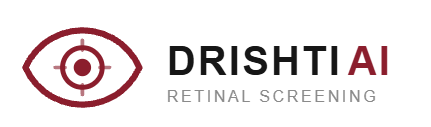
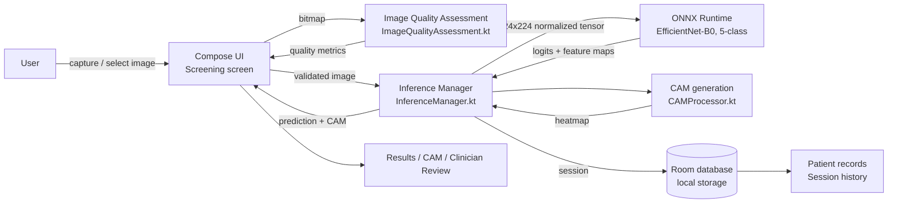
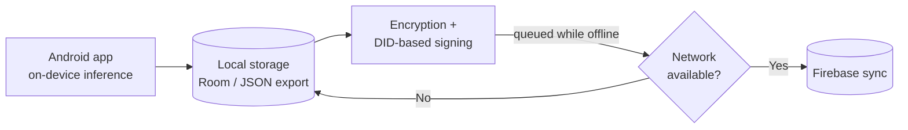

<p align="center">
  
</p>

<h1 align="center">Drishti AI Android</h1>
<p align="center"><b>Offline-first, explainable AI-assisted retinal screening for diabetic retinopathy on Android</b></p>

<p align="center">
  
  
  
  
  
  
  
</p>

<p align="center">
  <a href="#overview">Overview</a> ·
  <a href="#project-status">Status</a> ·
  <a href="#system-architecture">Architecture</a> ·
  <a href="#getting-started">Getting Started</a> ·
  <a href="#roadmap">Roadmap</a> ·
  <a href="#medical-disclaimer">Medical Disclaimer</a>
</p>

---


## Overview

Drishti AI is a Smart India Hackathon (SIH) 2026 project by **Team Wave** on *Explainable AI for Diabetic Retinopathy Screening in Rural India*. This repository is the **native Android client**. It brings the whole screening workflow to a smartphone:

**capture or import a fundus image → check image quality → run on-device AI → show the DR grade, confidence and an explainability heatmap → hand over to a clinician for review.**

Inference runs **entirely on the device** using a pre-trained EfficientNet-B0 classifier exported to ONNX and executed with ONNX Runtime. Screening therefore works with no internet connection, which is the situation in many rural and low-connectivity settings this project targets.

Drishti AI is a multi-part project:

| Part | Repository | Role |
|------|------------|------|
| **Android app** (this repo) | `drishti-ai-android` | Offline-first, on-device screening client |
| **Web app** | [`drishti-ai`](https://github.com/sayon-mitra024/drishti-ai) | Next.js screening dashboard; calls a hosted inference service |

## Problem

Diabetic retinopathy (DR) is a leading cause of preventable blindness. Early screening is effective, but it is limited by the availability of trained specialists to review retinal images, especially where ophthalmology infrastructure and reliable connectivity are scarce.

## Solution

An offline-first, smartphone-based screening-support workflow:

1. **Capture** a retinal image with the camera (or import from the gallery)
2. **Quality check** — assess resolution, illumination and contrast/focus
3. **Preprocess** — resize and normalize for the model
4. **AI inference** — 5-class DR severity grading on-device
5. **Explainability** — a class activation heatmap over the image
6. **Screening result** — predicted class, per-class probabilities, confidence, referral-support text
7. **Clinician review** — a human reviews before any decision is made
8. **Local record** — the session is saved on the device

Cloud synchronization and decentralized-identity security are **in development** (see [Project Status](#project-status)).

## Project Status

Drishti AI Android is under active development. This table states exactly what works today and what does not, so that nothing is over-claimed.

| Capability | Status |
|------------|:------:|
| Retinal image capture (CameraX) and gallery import | ✅ Implemented |
| Image-quality assessment (resolution, illumination, contrast/focus proxy) | ✅ Implemented |
| On-device EfficientNet-B0 inference (ONNX Runtime) | ✅ Implemented |
| 5-class DR grading with per-class probabilities and confidence | ✅ Implemented |
| CAM explainability heatmap | ✅ Implemented |
| Clinician review step in the workflow | ✅ Implemented |
| Local storage of patient metadata and screening sessions (Room) | ✅ Implemented |
| Firebase cloud sync — auto-upload of locally stored records when a network is available | 🚧 In development |
| Decentralized Identity (DID) based identity and record security | 🚧 In development |
| Application-level encryption of stored data and protected transmission | 🚧 In development |
| Guided recapture when image quality is not acceptable | 🚧 In development |
| Trained image-quality classifier (replacing the current heuristics) | 🚧 In development |
| Dataset validation and clinical evaluation | 🚧 In progress |
| Regulatory evaluation | 📋 Planned |

Legend: ✅ working today · 🚧 actively being built · 📋 not started.

**Today, all data stays on the device.** Nothing is sent to any server. Once Firebase sync is released, it will be opt-in and documented here.

## Key Features

- **Offline inference** — the complete classification pipeline runs on the phone; no internet required
- Retinal image capture via camera, or import from the gallery
- Real image-quality assessment based on pixel statistics (not a placeholder)
- 5-class diabetic retinopathy classification with per-class probabilities and confidence
- CAM visual explainability overlaid on the input image
- Built-in clinician review step — the app supports a human decision, it does not replace one
- Local patient metadata and screening-session management
- Modern Android stack: Kotlin, Jetpack Compose, Material Design 3

## System Architecture

### Current: fully on-device



### Target: offline-first with secure sync (in development)



The target design keeps the app usable offline, queues records locally, and uploads them automatically when connectivity returns. It is a design goal, **not yet a shipped feature**.

## AI Model

| Field | Value |
|-------|-------|
| Architecture | EfficientNet-B0 (torchvision), exported to ONNX |
| Task | Diabetic retinopathy classification, 5-class |
| Classes (exact index order) | `0: No DR`, `1: Mild`, `2: Moderate`, `3: Severe`, `4: Proliferative DR` |
| Input size | 224 × 224 |
| Preprocessing | Resize → normalize with ImageNet mean `[0.485, 0.456, 0.406]` and std `[0.229, 0.224, 0.225]`, performed on-device |
| Runtime | ONNX Runtime for Android (on-device) |
| Explainability | Class activation map (CAM) computed on-device after inference |
| Model file | `app/src/main/assets/models/efficientnet_b0_dr.onnx` (~22 MB) — see [Model weights](#model-weights) |

**Training data and evaluation metrics for the deployed checkpoint are not documented in this repository** and are not independently re-derived here. This app validates only the *shape* of the model output (5 finite, non-negative probabilities summing to ~1); it never adjusts confidence values.

### Research background (separate from this deployment)

Earlier experimentation was carried out on the **APTOS 2019 Blindness Detection** dataset (3,662 images, 5-fold cross-validation, EfficientNet-B0, 224×224, batch size 16, learning rate 0.001). These are results from the research phase — **not** a validated benchmark of the checkpoint bundled in this app, and not clinical performance figures.

| Setup | Accuracy | Macro F1 | QWK |
|-------|----------|----------|-----|
| Baseline | 0.7993 ± 0.0144 | 0.6563 ± 0.0134 | 0.8711 ± 0.0224 |
| FOV crop | 0.7952 ± 0.0150 | 0.6473 ± 0.0169 | 0.8753 ± 0.0145 |
| FOV + CLAHE | 0.7958 ± 0.0113 | 0.6566 ± 0.0152 | 0.8788 ± 0.0132 |

A single evaluation run also reported: Accuracy 0.7954, Macro F1 0.6526, QWK 0.8659, Referable-DR F1 0.9112, ECE 0.0501 — along with documented high-confidence misclassifications, which is why this remains a screening-support aid that requires clinician review.

### Model weights

The model weights are a protected part of this project (see [OWNERSHIP.md](OWNERSHIP.md)). The public repository does **not** grant any right to reuse them. To build a runnable app, place an authorized copy of `efficientnet_b0_dr.onnx` in `app/src/main/assets/models/`. Without it, the app builds but cannot run inference.

## Explainability

The class activation map (CAM) is computed on-device in `manager/CAMProcessor.kt` from the model's final convolutional feature maps and overlaid on the original image. It belongs to the same family of methods as the Grad-CAM explainability used in the Drishti AI research and web app.

A CAM highlights image regions associated with the model's prediction. It is an interpretability aid, **not** a clinical explanation, and does not by itself show why a grade is correct or incorrect.

## Android Application

- Kotlin, Jetpack Compose, Material Design 3
- Target API 34, minimum API 24 (Android 7.0+)
- `MainActivity.kt` — entry point
- `ui/screening/ScreeningScreen.kt` — 5-stage workflow: **Capture → Quality Check → AI Analyze → Results → Clinician Review**
- `ui/records/RecordsScreen.kt` — screening history and session management
- `manager/InferenceManager.kt` — ONNX Runtime orchestration
- `manager/CameraManager.kt` — CameraX capture
- `manager/ImageQualityAssessment.kt` — image-quality heuristics
- `manager/CAMProcessor.kt` — CAM generation
- `data/` — Room database and repository for local storage
- `ui/screening/components/` — reusable Compose components (capture, quality panel, probability bars, CAM viewer, clinician review)

## Inference Pipeline

Single-threaded ONNX Runtime pipeline in `manager/InferenceManager.kt`:

1. **Image input** — camera or gallery picker
2. **Validation** — MIME type (JPEG, PNG) and size (≤ 15 MB)
3. **Quality assessment** — resolution, illumination and contrast/focus proxy from pixel statistics
4. **Preprocess** — resize to 224×224, normalize with ImageNet statistics
5. **ONNX inference** — run the model on-device; validate the output against the exact 5-class contract
6. **CAM generation** — compute the heatmap from the final convolutional features
7. **Recommendation lookup** — static referral-support text per class (no prescriptions or dosages)
8. **Response validation** — 5 classes, finite values, probabilities sum to ~1
9. **Local storage** — save patient metadata, thumbnail, prediction and timestamp to Room

### On-device components

| Component | Purpose |
|-----------|---------|
| `InferenceManager.predict()` | Takes a bitmap; returns quality metrics, the prediction and a CAM heatmap |
| `ImageQualityAssessment.assess()` | Evaluates image quality and returns structured metrics |
| `CAMProcessor.generate()` | Generates the CAM visualization from model outputs |
| `SessionRepository.saveSession()` | Persists a screening session to the local database |

Illustrative prediction model (internal data class):

```kotlin
data class PredictionResult(
    val predictedClass: String,                   // e.g. "No DR"
    val predictedClassIndex: Int,                 // 0-4
    val confidence: Float,                        // 0.0-1.0
    val classProbabilities: Map<String, Float>,   // all 5 classes
    val qualityMetrics: ImageQualityMetrics,
    val camBitmap: Bitmap?,                       // explainability overlay
    val timestamp: Long
)
```

The Android app exposes **no network API**; all processing is local.

## Technology Stack

| Layer | Technology |
|-------|------------|
| UI | Jetpack Compose, Material Design 3 |
| Language | Kotlin 2.1.0 |
| Android | Target API 34, Min API 24 |
| ML inference | ONNX Runtime (`org.onnxruntime:onnxruntime-android`) |
| Camera | CameraX |
| Image loading | Coil |
| Local storage | Room, DataStore |
| Async | Kotlin Coroutines, Flow |
| Build | Gradle (Kotlin DSL) |
| Planned | Firebase (cloud sync), DID-based identity, application-level encryption |

## Project Structure

```
drishti-ai-android/
├── app/
│   └── src/
│       ├── main/
│       │   ├── kotlin/com/sayonedu/drishti/
│       │   │   ├── MainActivity.kt
│       │   │   ├── ui/
│       │   │   │   ├── screening/
│       │   │   │   │   ├── ScreeningScreen.kt
│       │   │   │   │   └── components/      # CameraCapture, QualityCheckPanel,
│       │   │   │   │                        # ProbabilityBars, CAMViewer, ClinicianReview
│       │   │   │   └── records/RecordsScreen.kt
│       │   │   ├── manager/                 # InferenceManager, CameraManager,
│       │   │   │                            # ImageQualityAssessment, CAMProcessor
│       │   │   ├── data/
│       │   │   │   ├── db/                  # ScreeningSession, SessionDao, AppDatabase
│       │   │   │   └── repository/          # SessionRepository
│       │   │   └── util/                    # ImageUtils, Constants
│       │   ├── res/                         # drawable/logo.png, values/colors.xml
│       │   └── AndroidManifest.xml
│       └── test/
├── build.gradle.kts
├── settings.gradle.kts
├── gradlew
├── LICENSE
├── OWNERSHIP.md
├── THIRD-PARTY-NOTICES.md
├── README.md
└── .gitignore
```

Planned additions for sync and identity (not yet in the codebase): a `data/sync/` module for the offline queue and Firebase upload, and a `security/` module for encryption and DID handling.

## Getting Started

### Prerequisites

- Android Studio (Flamingo or later)
- Android SDK 34+
- Kotlin 2.1.0+
- Gradle 8.0+ (via the included wrapper)

### Installation

```bash
git clone https://github.com/sayon-mitra024/drishti-ai-android.git
cd drishti-ai-android
```

Open the project in Android Studio and let Gradle sync.

### Key dependencies (`app/build.gradle.kts`)

```kotlin
android {
    compileSdk = 34
    defaultConfig {
        minSdk = 24
        targetSdk = 34
    }
}

dependencies {
    implementation("org.onnxruntime:onnxruntime-android:1.18.0")

    implementation(platform("androidx.compose:compose-bom:2024.09.00"))
    implementation("androidx.compose.ui:ui")
    implementation("androidx.compose.material3:material3")

    implementation("androidx.camera:camera-camera2:1.3.1")
    implementation("androidx.camera:camera-lifecycle:1.3.1")

    implementation("androidx.room:room-runtime:2.6.1")
    ksp("androidx.room:room-compiler:2.6.1")

    implementation("org.jetbrains.kotlinx:kotlinx-coroutines-android:1.7.3")
    implementation("io.coil-kt:coil-compose:2.6.0")
}
```

### Permissions

The app requests **camera** access for capture and reads gallery images through the system picker. Permissions are requested at runtime. Declare them in `AndroidManifest.xml` as implemented in this repository.

### Run and lint

```bash
./gradlew installDebug   # build and install a debug build
./gradlew lint           # run Android lint
```

### Release build

```bash
./gradlew assembleRelease   # APK
./gradlew bundleRelease     # AAB (configure signing first)
```

Signing keys and keystores are **never** committed to this repository.

## Privacy and Data Handling

- **Today:** all inference and all data storage happen on the device. No patient data leaves the phone.
- Screening sessions are stored in a local Room database inside the app's private storage. **Application-level database encryption is not yet implemented** — it is part of the in-development security work. Until then, protection relies on Android's app sandbox and the device's own storage encryption.
- **Planned:** encrypted storage, DID-based identity and signing of records, protected transmission, and privacy-aware cloud sync via Firebase. Sync will be opt-in and designed with India's Digital Personal Data Protection Act, 2023 in mind. This is a design intention, not a compliance claim.
- Do not use real patient data with a build of this app unless you have the appropriate consent, ethics approval and safeguards.

## Performance

Indicative only, not benchmarked results. Actual figures depend heavily on the device.

- Inference is CPU-bound on-device; expect roughly a second or two per image on recent mid-range and flagship phones
- Model size ~22 MB on disk
- Extended screening sessions will reduce battery life

Formal benchmarking on named devices is planned and will be published here once measured.

## Limitations

- Training data and evaluation metrics for the bundled checkpoint are not documented in this repository and have not been independently re-verified here.
- Firebase sync, DID-based security and application-level encryption are not yet integrated (see [Project Status](#project-status)).
- Image-quality assessment currently uses heuristics; a trained classifier and guided recapture are being developed.
- Inference speed varies with device hardware; older devices will be slower.
- Failed inferences surface as user-facing error messages, with no automatic retry.
- Model confidence is not clinical certainty, and CAM output is not a medical explanation.
- Generalization to unseen populations, cameras and retinal imaging devices has not been established.
- This is a research prototype and requires clinical validation, regulatory evaluation and human clinical oversight before any clinical use.

## Roadmap

- [x] On-device capture, quality check, inference, CAM, clinician review and local storage
- [ ] 🚧 **Firebase integration** — offline queue that uploads locally stored records automatically when the network is available
- [ ] 🚧 **Decentralized Identity (DID)** — identity and record security for clinicians, devices and screening records
- [ ] 🚧 **Data encryption** at rest and protected transmission
- [ ] 🚧 Guided image recapture when quality is not acceptable (in development)
- [ ] 🚧 Trained image-quality classification model to replace the heuristics (in development)
- [ ] Quantized or pruned model variants for low-end devices
- [ ] Benchmarking across named devices
- [ ] 🚧 Broad dataset validation and clinical evaluation (in progress)
- [ ] Google Play release

## Medical Disclaimer

> Drishti AI Android is an AI-assisted research and prototype screening system.
> It is not a medical device and does not replace a qualified
> ophthalmologist or healthcare professional.
>
> Predictions and visualizations must not be used as the sole basis
> for diagnosis, treatment, or clinical decision-making.
>
> Clinical validation, regulatory evaluation, and appropriate medical
> oversight are required before clinical deployment.

## Research and Reproducibility

This project combines an applied engineering prototype (this repository) with earlier model research carried out separately on the APTOS 2019 dataset. The on-device ONNX inference pipeline is the primary contribution of this Android implementation. Training code and full dataset access are outside the scope of this repository.

## Author

**Sayon Mitra** — B.Tech CSE Core, Chandigarh University
Team Wave · Smart India Hackathon 2026

Areas of interest: Artificial Intelligence, Machine Learning, Computer Vision, AI-assisted healthcare, research and innovation.

- Email: [sayonmitracode@gmail.com](mailto:sayonmitracode@gmail.com)
- Permissions and licensing: [sayon@sayonedu.in](mailto:sayon@sayonedu.in)
- Website: [sayonedu.in](https://sayonedu.in)

## Copyright and Usage

Original software, technical implementation and project-specific creative materials © 2026 Sayon Mitra, except where otherwise stated. **All rights reserved.**

This repository is public so that the work can be reviewed, cited and evaluated for research and thesis purposes. Public visibility does not grant permission to copy, modify, redistribute or commercialize it. See [LICENSE](LICENSE) and [OWNERSHIP.md](OWNERSHIP.md).

Third-party software, datasets and services remain under their own licenses and terms. See [THIRD-PARTY-NOTICES.md](THIRD-PARTY-NOTICES.md).

## Citation

If you refer to this work in academic writing, please cite it as:

```
Mitra, S. (2026). Drishti AI Android: Offline-first explainable AI-assisted
diabetic retinopathy screening on Android [Software]. Team Wave, Smart India
Hackathon 2026. https://github.com/sayon-mitra024/drishti-ai-android
```
